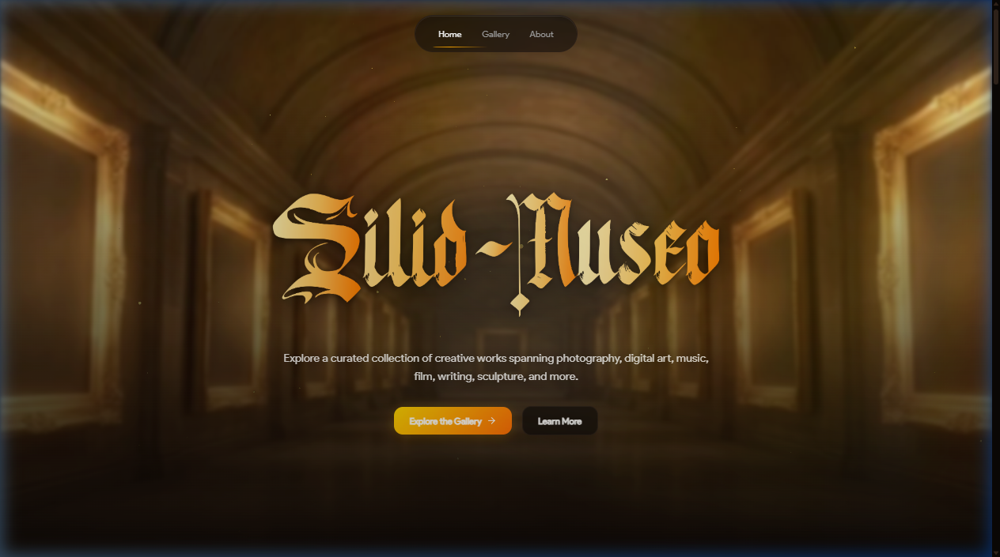
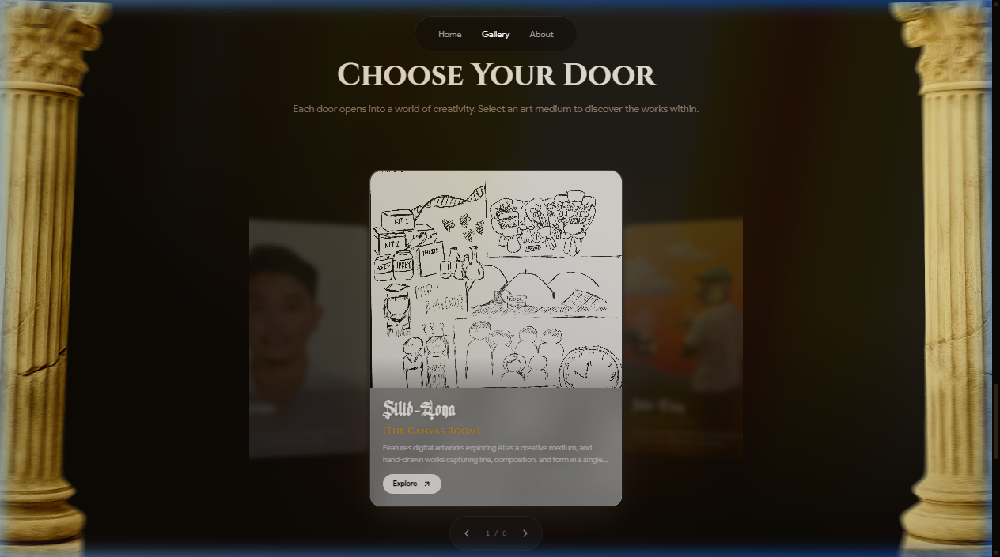
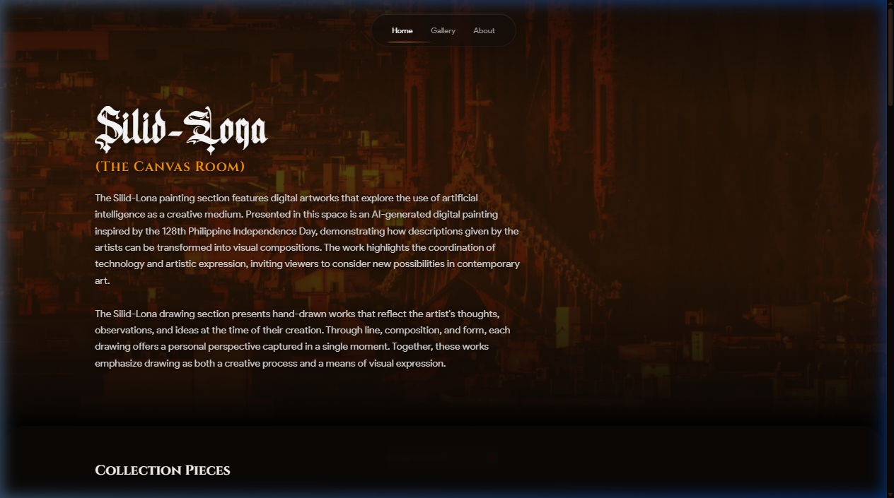

<p align="center">
  
</p>

<p align="center">
  <strong>A Premium, Interactive Virtual Gallery Celebrating Diverse Art Mediums</strong>
</p>

<p align="center">
  <a href="#key-features">Key Features</a> •
  <a href="#website-snippets">Website Snippets</a> •
  <a href="#technology-stack">Technology Stack</a> •
  <a href="#local-setup">Local Setup</a> •
  <a href="#directory-structure">Structure</a>
</p>

---

## 🎨 Overview

**Silid-Museo** is a portfolio-style interactive virtual gallery that showcases multiple art mediums organized into distinct exhibition halls (categories). Built with a focus on rich design aesthetics, micro-animations, and smooth transitions, the platform bridges the gap between digital/traditional artists and their audience. Visitors can explore various forms of expression, rate artworks, and leave exhibition feedback.

---

## 🚀 Key Features

*   ✨ **Scroll-Scrubbed Cinematic Hero**: An immersive, frame-by-frame scroll hero animation introducing the virtual gallery experience.
*   🚪 **"Choose Your Door" Focus Rail**: A 3D-enhanced category carousel featuring **interactive thumbnail cycling**—each category card dynamically cycles through the thumbnails of actual exhibition pieces inside using smooth fade-in/fade-out cross-fade transitions.
*   🖼️ **Exhibition Halls**: Dedicated layouts tailored for different media categories:
    *   *Silid-Lona (The Canvas Room)*: Paintings and hand-drawn works.
    *   *Silid-Tinig (The Audio Room)*: Original music and songwriting.
    *   *Silid-Salin (The Transcreation Room)*: Interactive theatrical adaptations and video.
    *   *Silid-Kasaysayan (The History Room)*: Presentation of timeline and art history.
    *   *Silid-Espasyo (The Spatial Room)*: Installation art and scale models.
    *   *Silid-Aninag (The Screening Room)*: Digital storytelling, films, and animations.
    *   *Silid-Manlilikha (The Creators' Room)*: Tribute to collaborators and project mentors.
*   💬 **Audience Engagement**: Interactive lightboxes with medium-specific media players, real-time ratings, and exhibition feedback/comment walls.
*   🛡️ **Admin Dashboard**: Secure admin interface to upload, update, or remove artworks, customize cover images, and manage category configurations.

---

## 📸 Website Snippets

### Immersive Hero Landing
<p align="center">
  
</p>

### Interactive Category Focus Rail (Choose Your Door)
<p align="center">
  
</p>

### Exhibition Hall Collection
<p align="center">
  
</p>

---

## 🛠️ Technology Stack

*   **Frontend Core**: React 19, Vite, Javascript, Vanilla CSS.
*   **Animations**: Framer Motion (spatial layouts & fade transitions), GSAP (scroll-scrub interactions).
*   **Icons**: Lucide React.
*   **Database & Storage**: Supabase (PostgreSQL database for metadata/ratings/feedback, and Bucket Storage for hosting artwork files).
*   **Deployment**: Vercel.

---

## ⚙️ Local Setup

Follow these steps to run the application locally on your machine:

### Prerequisites
Make sure you have [Node.js](https://nodejs.org/) installed (v18 or higher recommended).

### 1. Clone the Repository
```bash
git clone https://github.com/markvncent/Silid-Museo.git
cd Silid-Museo
```

### 2. Configure Environment Variables
Inside the `silid-museo` directory, create a `.env.local` file (you can duplicate `.env.example`) and fill in your Supabase connection parameters:
```env
VITE_SUPABASE_URL=your_supabase_project_url
VITE_SUPABASE_ANON_KEY=your_supabase_anon_public_key
```

### 3. Install Dependencies & Start Development Server
```bash
cd silid-museo
npm install
npm run dev
```
Open your browser and navigate to `http://localhost:5173/` to view the app!

### 4. Build for Production
To generate a production-ready package:
```bash
npm run build
```

---

## 📂 Directory Structure

```text
Silid-Museo/
├── docs/                 # Documentation and design resources
│   └── screenshots/      # README website previews & snippets
├── supabase/             # Database schemas, migrations, and functions
└── silid-museo/          # Main React Application
    ├── public/           # Static assets, fonts, and hero-scrub frames
    └── src/
        ├── assets/       # Branding logos, wordmark, and style assets
        ├── components/   # Reusable UI elements & layouts
        ├── context/      # React contexts (e.g. Modals)
        ├── data/         # Fallback data and category configs
        ├── pages/        # Main landing and exhibition page layouts
        └── services/     # Supabase client hooks and API integrations
```
